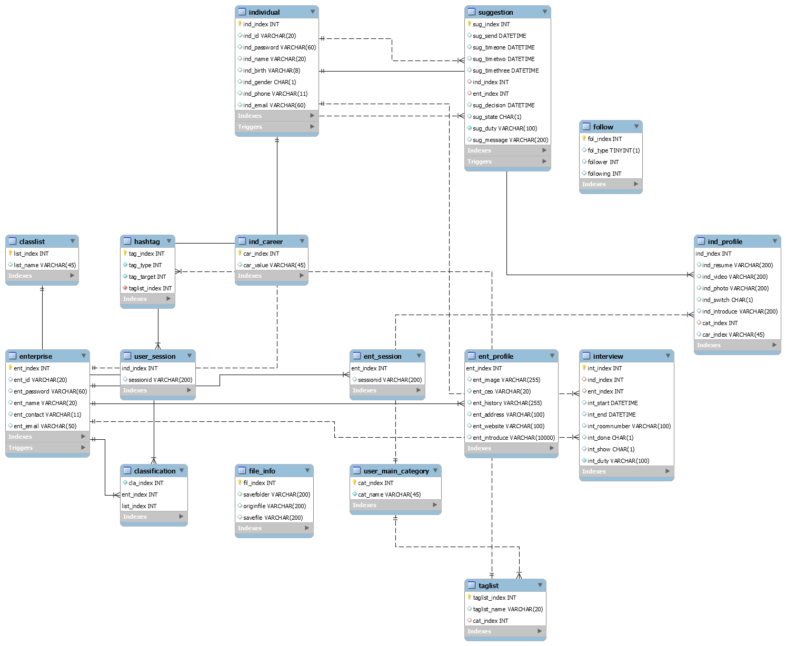

# 포팅 메뉴얼


## 목차

 1. 배포문서
    1. 개발 버전
       - JAVA : OpenJDK8(zulu) 1.8
       
       - STS : 12.17.0
       
       - kurento : 6.15.0
       
       - Tomcat : 2.5.2
       
       - MySQL : 8.0.26
       
       - Mave : 4.0
       
       - VUE : Vue3
       
       - Vuex : 4.0
       
       - Node : 12.17.0
       
       - Nginx : stable-alpine
       
         
       
    2.  Installation with Local
         - 로컬에서 백앤드 실행 시 명령어

            ```
            cd peopool
            
            #window cmd 실행
            mvn -U clean spring-boot:run -Dspring-boot.run.jvmArguments="-Dkms.url=ws://52.79.162.52:8888/kurento" 
            ```

            - https://i5d206.p.ssafy.io:8443/swagger-ui.html 통해  swagger 확인 가능

         - 로컬에서 프런트 실행 시 명령어

            ```
            cd test00
            npm install
            npm run serve  
            ```

    3. 데이터베이스

       1. 버전

          - Mysql 8.0.26

       2. 접속정보

          - Hostname : i5D206.p.ssafy.io:3306

          - username : peopool

            

       3. Install

          ```
          sudo apt-get install mysql
          ```

          

       4. Property (In spring - application.properties)

          ```properties
          spring.datasource.driver-class-name=com.mysql.cj.jdbc.Driver
          
          spring.datasource.url=jdbc:mysql://52.79.162.52:3306/peopool
          
          spring.datasource.username=peopool
          ```

          

       5. ER-Diagram

          

 2. 외부 서비스 정보 문서
    1. Kurento
          - [문서참조](https://doc-kurento.readthedocs.io/en/latest/)


 3. 데이터베이스 덤프 파일
    - [덤프 파일 최종본](dasdfas)


#  Architecture


## 기획 배경

코로나 19로 점점 화상 면접을 많이 시행하고 있습니다. 하지만 채용 프로세스는 따로 관리해야 합니다. 

서류만으로는 한계를 느끼는 취업 준비생들과 이직을 준비하는 사람들에게 PR 영상을 올려 기업들에 노출할 수 있습니다.

기업의 입장에서는 서류뿐만 아니라 영상으로 구직자를 만나기 때문에 더 다양한 관점에서 우리 기업에 이 사람이 맞을지 생각할 수 있습니다.


## Project Structure

```
📦PJT
 ┣ 📂peopool 	#Backend
 ┃ 	┣ 📂src/main/java	#Backend 코드
 ┃    ┣ 📂com
 ┃      ┣ 📂ssafy
 ┃        ┣ 📂peopool
 ┃          ┣ 📂auth
 ┃        	┣ 📂cofig
 ┃          ┣ 📂controller
 ┃          ┣ 📂model
 ┃          ┣ 📂request
 ┃          ┣ 📂response
 ┃          ┣ 📂util
 ┃ 			┣ 📂webrtc
 ┃	 ┣ 📂resources
 ┃	 	┣ 📂mapper
 ┣ 📂test00			# Frontend 코드
 ┃   ┣ 📂.certs 
 ┃ 	 ┣ 📂nginx			
 ┃ 	 ┣ 📂public		
 ┃ 	 ┣ 📂src		
 ┃		┣ 📂assets
 ┃		┣ 📂plugins
 ┃ 	    ┣ 📂router
 ┃ 	    ┣ 📂store
 ┃ 	    ┣ 📂views
 ┃ 	    ┣ 📂components
 ┃ 	      ┣ 📂Account
 ┃ 	      ┣ 📂InterviewRoom
 ┃ 	      ┣ 📂MainBasic
 ┃ 	      ┣ 📂MainCompany
 ┃ 	      ┣ 📂MainUser
 ┃ 	      ┣ 📂Recruitment
 ┃ 	      ┣ 📂SideBarComponents
 ┃ 			┣ 📂CompanyProfileInf
 ┃ 			┣ 📂FollowOfCompany
 ┃ 			┣ 📂UserProfileInfo
 ┃ 	      	┣ 📂FollowOfUser
 ┃ 	      	┣ 📂UserOfInterview
 ┣ 📂exec				# 산출물
 ┣ 📜Jenknsfile			#Docker 설정파일
 ┗ 📜README.md			# 프로젝트 README
```


## 시연

#### 팔로잉 기능

-  기업이 개인을 팔로우 및 팔로워 


- 개인이 기업을 팔로우 및 팔로워

![[유저] 기업을 팔로우 하기 및 팔로워 팔로잉 확인](C:\Users\multicampus\Documents\카카오톡 받은 파일\[기업] 태그검색 키워드 검색 화상회의\[유저] 기업을 팔로우 하기 및 팔로워 팔로잉 확인.gif)


#### 태그 검색 기능

- 기업이 개인 유저 태그 검색 (OR 과 AND) 적용 

![[기업] 유저 태그 검색](C:\Users\multicampus\Documents\카카오톡 받은 파일\[기업] 태그검색 키워드 검색 화상회의\[기업] 유저 태그 검색.gif)


-  유저가 기업 태그 검색

  ![[유저]기업 태그 검색](C:\Users\multicampus\Documents\카카오톡 받은 파일\[기업] 태그검색 키워드 검색 화상회의\[유저]기업 태그 검색.gif)

#### 키워드 검색 기능

#### 면접 요청 기능

- 기업 회원이 마음에 드는 구직자가 있다면 개인 회원에게 면접 요청을 할 수 있습니다. 3개의 면접 요청 시간 리스트를 보낼 수 있으며 

  면접 요청을 받은 개인 회원은 그 시간 중 마음에 드는 시간을 면접 시간으로 픽스할 수 있습니다.

  ↓개인                                 																							↓ 기업

  


#### 화상 면접 기능 (WebRTC)

-  URL을 통해서도 면접장에 입장 가능하며 면접 장 내 실시간 채팅을 통해서 소통이 가능합니다.

![[기업] 화상회의](C:\Users\multicampus\Documents\카카오톡 받은 파일\[기업] 태그검색 키워드 검색 화상회의\[기업] 화상회의.gif)


#### 면접 프로세스 관리 기능

-  기업과 개인은 각 면접에 대한 프로세스를 가지게 됩니다.

  기업의 입장에서는 미응답 - 거절된면접 - 면접 진행 - 심사 - 입사 제안 중 으로 나뉘며 다음과 같이 채용 프로세스를 관리 할 수 있습니다.

#### 


-  개인의 입장에서는 받은요청 - 수락한 면접 - 결과 대기 - 결과 순으로 프로세스가 정해져 있으며 그동안 면접을 보았던 것도 볼 수 있습니다.


